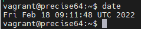

HYPERVISORS

1. There is 2 types of hypervisors. First type work as a layer between hardware and guests OS
without host OS in between. 2nd type is a hypervisors that work above host OS.
Most popular hypervisors are VirtualBox, Hyper-VirtualBox.
2. Main difference between them is how they work, and some limitation, based of how much memory can your guest machine have, or how many guests OS you can mane over one PC or server

WORK WITH VIRTUALBOX

I don't know what should be an answer to that part, but i did all of that in me host machine and there was one problem after cloning. machine-id for Ubuntu stays the same and you had to change it manually with a command, because with same id DHCP give same IP for both machines.

Table of task 2.4

| Mode      | VM->Host  | VM<-Host  | VM1-VM2  | VM-Net  |
|-----------|-----------|-----------|----------|---------|
| Host-only |     +     |      +    |     +    |     -   |
| Internal  |     +     |      +    |     +    |     -   |
| Bridged   |     +     |      +    |     +    |     +   |
| NAT       |     +     |      ?    |     ?    |     +   |
| NATNetwork|     +     |      -    |     +    |     +   |

Question marks there for a reason, because NAT game same IP to both instances. And checking it by ping is not appropriate choose.

WORK WITH VAGRANT



To create my own box file i used base Ubuntu box, downloaded with command:

```bat
vagrant box add %name_of_the_box% %url_to_box%
```

after that you could deploy that box, connect to it, make some changes e.g. install apache, or nginx, then stop your VM and make box file with web server installed with this command:

```bat
vagrant package
```

this command will run a process of creating box file with a name - package.box